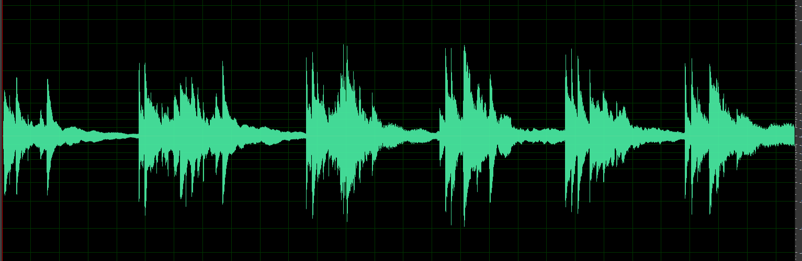
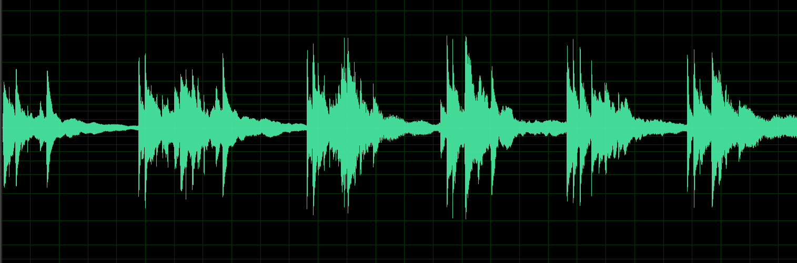
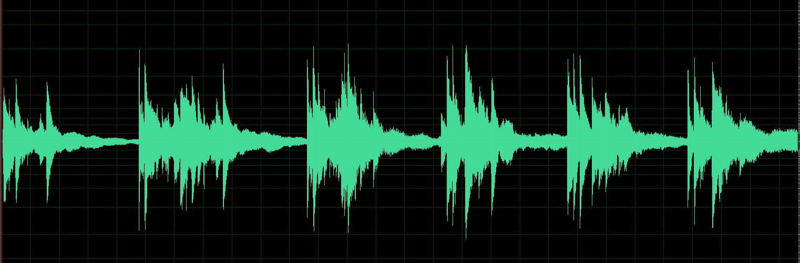

### G726 编解码

参考  
> [canbus/pcm_adpcm_g726](https://github.com/canbus/pcm_adpcm_g726)  
> [ffmpeg G726](https://github.com/FFmpeg/FFmpeg/blob/master/libavcodec/g726.c)  

- [x] 40kbps
- [x] 32kbps
- [x] 24kbps
- [x] 16kbps


### 示例
```go
package main

import (
	"github.com/general252/g726"
	"os"
)

func main() {
	pcmIn, err := os.ReadFile("audio-samples.pcm")
	if err != nil {
		return
	}

	if pcmOut, err := recode(g726.G726Rate32kbps, pcmIn);err != nil {
		return
	} else {
		_ = os.WriteFile("audio-samples-re-32kbps.pcm", pcmOut, 0644)
	}

	if pcmOut, err := recode(g726.G726Rate16kbps, pcmIn);err != nil {
		return
	} else {
		_ = os.WriteFile("audio-samples-re-16kbps.pcm", pcmOut, 0644)
	}
}

// 编码为指定码率的g726后, 再解码为pcm原始数据
func recode(rate g726.G726Rate, pcm []byte) ([]byte, error) {
	encoder := g726.G726_init_state(rate)
	g726Data, err := encoder.EncodeSimple(pcm)
	if err != nil {
		return nil, err
	}

	decoder := g726.G726_init_state(rate)
	outPCM, err := decoder.DecodeSimple(g726Data)
	if err != nil {
		return nil, err
	}

	return outPCM, nil
}

```


### 测试

原始音频数据


32kbps 压缩后的音频数据


16kbps 压缩后的音频数据


  
